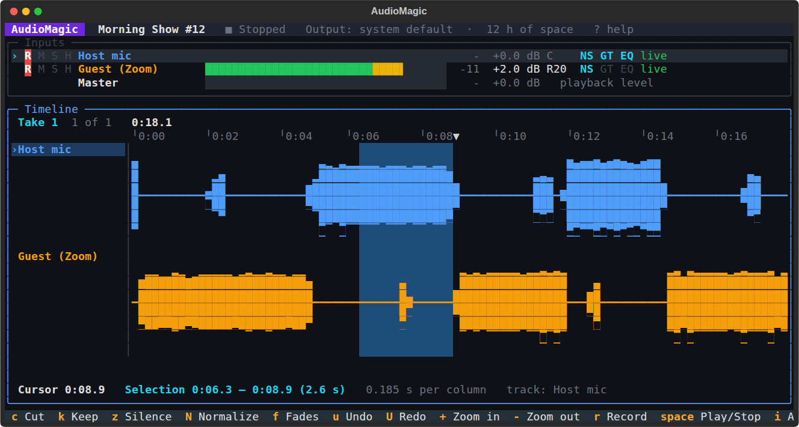

# AudioMagic

A simple multi-input recorder for Linux, built on PipeWire. It sits between
Audacity and Ardour: record several microphones, interface inputs, programs
and streams at once, each on its own track with its own controls. Tidy up
the take, then export it as FLAC, Ogg or MP3.


## What it does

- **Multiple inputs, each with its own controls.** Every input is a track with
  record-arm, mute, solo, live monitoring, volume, pan, a level meter and a clip light.
- **Anything PipeWire can see:**
  - microphones and USB interfaces, with each input jack as its own track if you like
  - one program's audio, such as a Discord, Zoom or Jitsi call with remote guests, a browser or a game
  - everything playing through an output
- **Internet streams and other software:**
  - Icecast/HTTP radio, HLS and RTSP
  - OBS, ffmpeg or another computer over **SRT**, encrypted with a passphrase
- **Per-track effects:** noise suppression, noise gate and EQ with a low cut, plus
  a "Voice" preset. Effects never touch the raw recording. You hear them while
  monitoring and playing back, and they're applied when you export.
- **Light editing:** cut a section from all tracks, silence a section on one
  track, keep only a selection, fade in and out, normalize a track. Undo and
  redo work for all of it. Edits never modify the recorded files.
- **Export** to FLAC, Ogg Opus, Ogg Vorbis, MP3 or WAV:
  - as one mix, one file per track, or both
  - stereo or mono, with tags
  - optional loudness normalization (podcast -16 LUFS, streaming -14 LUFS, broadcast -23 LUFS)
- **Safe recording:**
  - each track is written straight to a 24-bit / 48 kHz WAV file as it records
  - a take cut off by a crash is repaired the next time you open the project
  - all tracks line up in time, even from different devices

It's a desktop app: it opens in its own window and runs on your computer.
Nothing is uploaded anywhere. It also runs [inside a terminal](#in-a-terminal),
driven from the keyboard.

## Install as a Flatpak (recommended)

The Flatpak brings everything AudioMagic needs with it (ffmpeg, the
PipeWire tools, NumPy and friends) and keeps itself to itself, so there is
nothing to install with `apt`.

**Ready-made:** every push builds and tests one on GitHub. Open the repository's
**Actions** tab, pick the latest green **Flatpak** run, download the
**AudioMagic-flatpak** artifact and unzip it. Then:

```bash
flatpak install --user AudioMagic.flatpak
flatpak run io.github.derikatwork.AudioMagic      # or find AudioMagic in the app menu
```

The first install also fetches the GNOME runtime from Flathub (a few hundred
MB, shared with other Flatpak apps). Pop!_OS has Flathub set up already; on
plain Ubuntu run
`flatpak remote-add --user --if-not-exists flathub https://dl.flathub.org/repo/flathub.flatpakrepo` first.

**Or build it yourself** (about 15 minutes the first time):

```bash
sudo apt install flatpak-builder
flatpak-builder --user --install --install-deps-from=flathub --force-clean \
    build-dir flatpak/io.github.derikatwork.AudioMagic.yml
```

What the Flatpak is allowed to use: PipeWire (recording), PipeWire's
PulseAudio service (playback and monitoring; it's on by default in Pop!_OS),
the network (internet streams, SRT from OBS, its own local page) and your home
folder (projects in `~/Music/AudioMagic`, exports wherever you choose).
Recordings are in the same place as with the normal install; settings live
in `~/.var/app/io.github.derikatwork.AudioMagic/`.

To update, install a newer bundle the same way. To remove it:
`flatpak uninstall io.github.derikatwork.AudioMagic` (your recordings are kept).

## Install without Flatpak (Pop!_OS / Ubuntu 22.04 or newer)

```bash
git clone https://github.com/derikatwork/audiomagic.git
cd audiomagic
./install.sh
```

The installer asks before installing the system packages it needs
(GStreamer, PipeWire tools, ffmpeg, WebKitGTK, NumPy/SciPy, aiohttp). It then
puts AudioMagic in your home folder and adds it to the app menu. For the
[terminal interface](#in-a-terminal) it also downloads Textual, pinned to
exact versions, into AudioMagic's own folder, where nothing else uses it.

To remove it later, run `./uninstall.sh`. Your recordings are kept.

To run it straight from the source folder without installing:
`python3 -m audiomagic`. To see whether anything is missing: `python3 -m audiomagic --check`.
For the terminal interface from the source folder, first run
`python3 -m pip install --target vendor --require-hashes -r requirements-tui.txt`.

## Using it

1. **Add inputs.** Click **Add input** and choose:

   | Tab | What it records |
   |---|---|
   | Microphones & interfaces | A device, or a single input of an audio interface ("Each input as its own track"). |
   | Programs | One program's sound. Start the call or playback first so the program shows up. |
   | Everything you hear | Everything playing on an output. |
   | Internet stream | Paste a stream address. |
   | OBS / network (SRT) | Shows the exact address to paste into OBS. |
   | Test tone | A steady tone for checking the setup. |

2. **Check levels.** Speak at a normal volume. The meter should peak in the
   yellow. A red clip light means the source itself is too loud: turn it down
   on the microphone, the interface or in the system sound settings.
3. **Record.** Every input with its red **R** lit is recorded. The **R** key
   starts and stops recording.
4. **Edit.** Drag across the waveform to select part of it. Then:
   - **Cut** removes the selection from every track.
   - **Silence** mutes the selection on the track you dragged on.
   - **Keep selection** trims everything else away.

   Fades are in the edit bar. Normalize is in each track's **⋯** menu.
5. **Export.** Pick the format, whether you want the mix and/or separate
   tracks, a loudness target and tags.


### Remote guests

Have your guests join a normal call (Discord, Zoom, Jitsi, Teams in the
browser…), then add that program under **Programs**. The call is recorded on
its own track, alongside your microphone. Use headphones so the call doesn't
leak into your mic.

### OBS and other computers (SRT)

Add an **OBS / network (SRT)** input. AudioMagic listens on the port shown and
displays an address like:

```
srt://127.0.0.1:9000?mode=caller&passphrase=…&pbkeylen=16
```

In OBS, go to *Settings → Stream*, choose Service **Custom…**, paste that
address as the Server and leave the Stream Key empty. The passphrase encrypts
the stream (AES-128). Turn on "Allow other computers on my network" to accept
streams from another machine; then use this computer's IP address instead of
`127.0.0.1`.

### Monitoring

The headphones button on a track plays that input live, with its effects, to
the output chosen at the top right. Expect roughly 30–60 ms of delay, which is
fine for checking sound but noticeable if you're singing along. For zero
delay while performing, use your interface's direct monitoring.

### Keyboard

| Key | Action |
|---|---|
| Space | Play / pause |
| R | Start / stop recording |
| Delete | Cut the selection |
| Ctrl+Z / Ctrl+Shift+Z | Undo / redo |
| + / - / F | Zoom in / out / fit (Ctrl+scroll zooms too) |
| Home / End | Jump to start / end |
| Esc | Clear the selection |

## In a terminal

AudioMagic also runs inside a terminal, driven from the keyboard. It's the same
app underneath, with the same projects, recordings, effects and export. It
needs no display, so it also works on a recording machine you reach over SSH.

```bash
audiomagic --tui
flatpak run io.github.derikatwork.AudioMagic --tui     # the Flatpak
```



The top half lists the inputs, each with its meter and mixer controls. The
bottom half shows a take as a waveform, with a cursor and a selection for
editing. **Tab** switches between them. The bottom line lists the main keys
for the half you're in, and **?** shows them all:

| Where | Keys |
|---|---|
| Anywhere | `r` record / stop · `space` play from the cursor / stop · `p` pause · `[` `]` previous / next take · `i` add an input · `x` export · `o` projects · `d` output device · `?` help · `q` or `Ctrl`+`C` quit |
| Inputs | `↑` `↓` pick (the last row is the master level) · `a` arm · `m` mute · `s` solo · `h` hear (monitor) · `+` `-` level · `←` `→` pan · `e` effects · `c` change the source · `n` rename · `Del` remove |
| Timeline | `←` `→` move the cursor · `Shift`+`←` `→` select · `↑` `↓` pick a track · `c` or `Del` cut · `k` keep only the selection · `z` silence on the picked track · `N` normalize it · `f` fades · `u` / `U` undo / redo · `+` `-` `0` zoom in / out / fit · `n` / `D` rename / delete the take |

The mouse works too: click the timeline to move the cursor and drag to
select. Quitting while recording asks first, and a recording is always saved,
even when the terminal is closed.

Only one copy of AudioMagic runs at a time, so close the window before
starting it in a terminal. Messages that would otherwise land in the terminal
go to `~/.cache/audiomagic/tui.log` (in the Flatpak,
`~/.var/app/io.github.derikatwork.AudioMagic/cache/audiomagic/tui.log`).

## Where things are saved

```
~/Music/AudioMagic/<Project>/
    project.json                 inputs, takes and edits
    audio/take-001/01-host.wav   the raw recordings (24-bit WAV, one per track)
    exports/                     your exported files
```

Deleted takes and removed tracks go to the desktop trash, so they can be
restored. Settings live in `~/.config/audiomagic/`.

## Troubleshooting

- **An input says "device not connected".** Plug it back in; AudioMagic picks
  it up again automatically.
- **A program isn't listed.** Programs only appear while they are playing
  sound. Start the call or video, then press **Refresh**.
- **"Effects are using more CPU than this computer has".** It can't run the
  live effects for this many inputs in real time, so meters and monitoring
  may stutter. **Your recordings are not affected** (effects are only applied
  live for listening; the files are always recorded raw). Turn off noise
  suppression on some inputs to make it go away.
- **An input "lost audio".** If a device drops out for a moment (a USB
  hiccup), the gap is filled with silence so it stays in sync with the other
  inputs, and the log says so.
- **Export says there isn't enough space.** Exporting writes temporary files
  next to the export folder (about 700 MB per mono track per hour, plus the
  finished files). Free some space or choose another folder.
- **No window, it opened in the browser.** WebKitGTK is missing:
  `sudo apt install gir1.2-webkit2-4.1`. Or run `audiomagic --browser` on purpose.
- **`audiomagic --tui` says it needs Textual.** Run `./install.sh` again
  while online; it downloads Textual for the terminal interface.
- **Something else.** Run `audiomagic --check`, and `audiomagic --debug` for
  detailed logs.

## How it's built

| Part | Technology |
|---|---|
| Capture | PipeWire, through GStreamer's `pipewiresrc`. Inputs are found and watched with `pw-dump`. |
| Monitoring and playback | Played through PipeWire's PulseAudio service (`pulsesink`), which PipeWire mixes and routes. (PipeWire 1.0's own `pipewiresink` can deadlock when a stream starts; it's only used if that service isn't running.) |
| Effects | Written in NumPy/SciPy, so live monitoring, playback and export sound identical. |
| Export | ffmpeg: encoding, tags and two-pass loudness normalization. |
| Interface | A local web page (HTML/JS, no build step) in a GTK WebKit window. The server listens only on 127.0.0.1 and every request needs a per-launch secret key. |
| Terminal interface | [Textual](https://textual.textualize.io). It drives the same engine directly, in the same process, with no local server. |

Code map (`audiomagic/`):

| File | Role |
|---|---|
| `engine.py` | Ties everything together |
| `capture.py` | Inputs |
| `recorder.py` | Writing takes, lining tracks up |
| `dsp.py` | Effects |
| `render.py` | Edits + effects + mix |
| `export.py` | Export |
| `server.py` | Local API |
| `app.py` | Window and start-up |
| `tui.py` | The terminal interface |
| `web/` | The interface |

### Tests

```bash
python3 -m pytest tests
```

The tests in `tests/test_pipewire.py`, `test_network.py` and
`test_server.py` need a running PipeWire. They create their own virtual
devices, record from them and check the results: timing alignment between
inputs, monitoring, playback, edits and every export format.
`test_stress.py` records 11 inputs with every effect on and checks that not a
single sample is lost, even when Python stalls for most of a second.
`test_qa.py` covers edge cases: fuzzed edits, awkward file names, crashes and a
full disk during recording, cancelled exports and malformed API requests.
`test_tui.py` drives the terminal interface key by key through Textual's test
pilot: adding inputs, the mixer, effects, recording, every kind of edit,
playback, export and projects. It also runs it once in a real
pseudo-terminal and stops it with SIGTERM mid-recording; the take must be
saved.
[docs/QA-REPORT.md](docs/QA-REPORT.md) has the results of the longer stress runs.

The Flatpak (`flatpak/`) is built on every push by
`.github/workflows/flatpak.yml`, which then installs it on a clean machine
and runs `flatpak/smoke_test.py`: it records from virtual devices, monitors,
plays back and exports every format from inside the sandbox, and opens the
window on a virtual display. `flatpak/tui_smoke_test.py` then runs the
terminal interface from the sandbox: it adds an input, records and quits.

## Not yet

- Recording new tracks while playing earlier ones (overdubbing).
- Built-in invite links for remote guests (use a call program for now).
- The noise suppressor is a classic spectral one: great for fans, hiss and
  hum, less so for sudden noises like keyboard clicks or dogs.

## Licence

AudioMagic is free software under the [MIT licence](LICENSE): use it, change
it and share it however you like, as long as the copyright notice stays with
it. The Flatpak also includes other open-source components under their own
licences (FFmpeg and LAME under the LGPL, SRT under the MPL, PipeWire under
MIT, and others); see [THIRD-PARTY-NOTICES.md](THIRD-PARTY-NOTICES.md).
